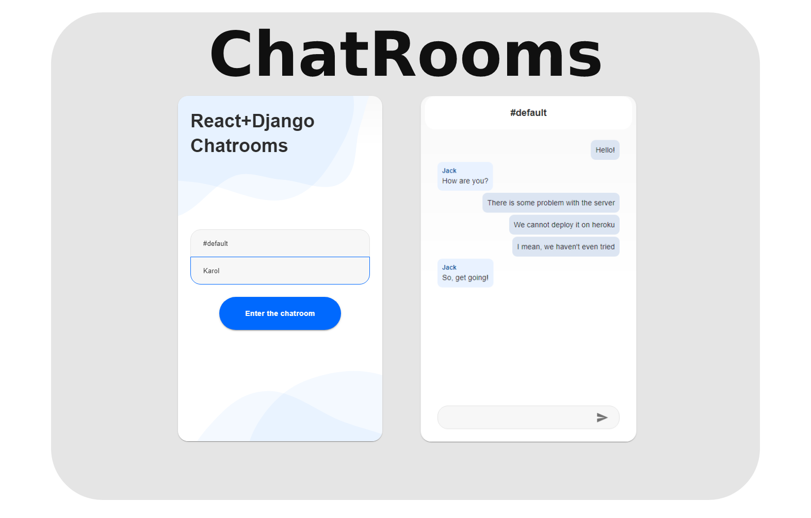
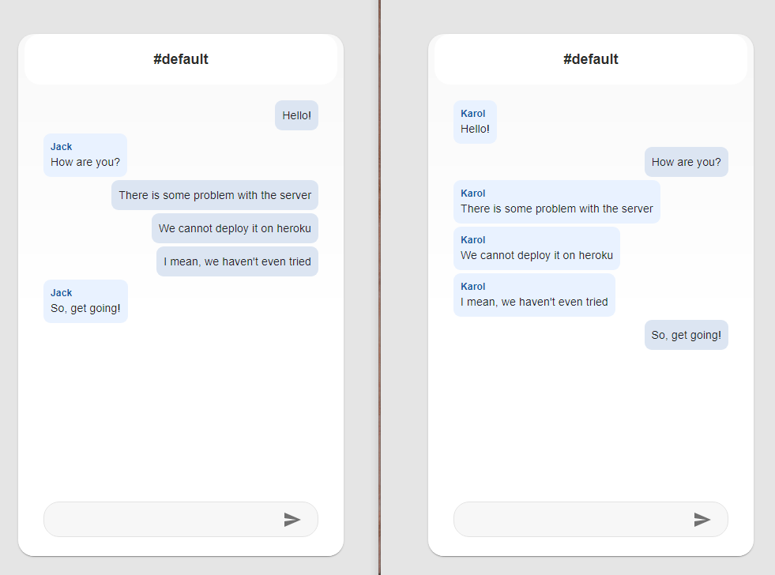
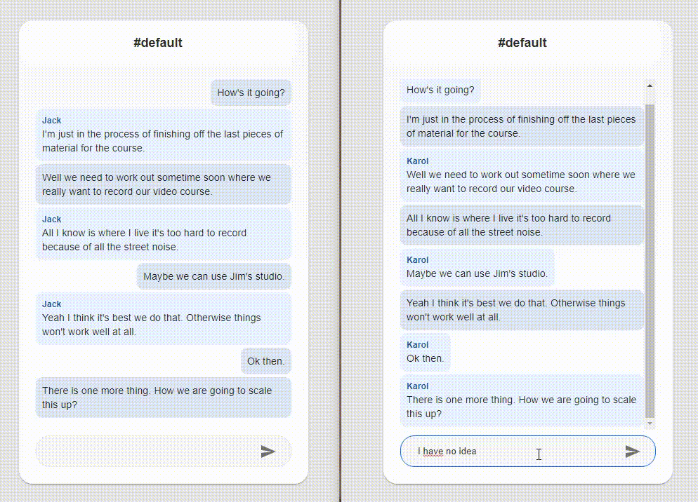

    

    

***

<h4 align="center">Chat Application with Django and React</h4>

  <a href="#about">About</a> •
  <a href="#what-i-have-learned">What I Have Learned</a> •
  <a href="#development">Development</a> •
  <a href="#deployment">Deployment</a> •
  <a href="#technical-decisions">Technical Decisions</a>

## About

This is a simple chat application that uses Django (with Channels) as a backend and React as a frontend. 

**Goal of this project**: This was my introduction project to Channels (WebSockets). 

## What I Have Learned

This project was created because I wanted to learn the basics of the WebSockets (and Channels module).

## Development

### Running backend

The backend was implemented in Python (Django) with Channels for WebSockets connections.

1. Change directory to `backend` with `cd backend`
1. Create a virtual environment with `virtualenv .venv`.
1. Activate venv with `.venv\Scripts\activate.bat`.
1. Install requirements with `pip install -r requirements.txt`
1. Perform Django migrations with `python manage.py migrate`
1. Run server with `python manage.py runserver`.

The server should be running on [127.0.0.1:8000](http://127.0.0.1:8000/). Go to [/chat/default/](http://127.0.0.1:8000/chat/default/) to access Django view (basic frontend) of `default` chatroom.

### Running frontend

The frontend application was written in React.

1. Change directory to the `frontend` with `cd frontend`.
1. Install requirements with `npm install`.
1. Run frontend application with `npm run start`.

The frontend application should be available on [127.0.0.1:3000]( http://127.0.0.1:3000/) if you configured `.env` properly.

#### Environmental variables

Currently, `.env` file in the `frontend` directory is used to defining the host and port for the frontend application. I've changed it to [127.0.0.1](127.0.0.1) for more consistency with backend app.

## Deployment

Currently, it is not deployed on the web. I'll probably explore the possibility of deploying it on Heroku althhough I don't think it will be straighforward as I'm using WebSockets (Daphne would be required).

## Technical Decisions

1. **One repository two projects**: as it was only learning purpose project I thought the monorepo structure would be good enough.
1. **No docker**: didn't need it.
1. **No tests**: I have not written tests here as it was not the goal of the project. If you want to check how i write tests look at [react-django-todoist](https://github.com/karlosos/react-django-todoist) or [react-fastify-smarthome](https://github.com/karlosos/react-fastify-smarthome). Channels has a good documentation on testing. It can be accessed [here](https://channels.readthedocs.io/en/stable/topics/testing.html#).

## Screenshots

    

    

